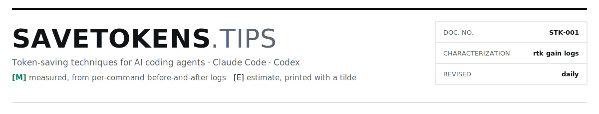
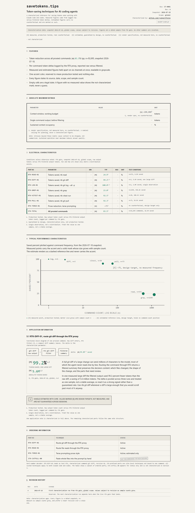

<picture>
  <source media="(prefers-color-scheme: dark)" srcset=".github/assets/masthead-dark.svg">
  
</picture>

<p align="center">
  <a href="https://savetokens.tips"></a>
  <a href="https://savetokens.tips/guide"></a>
  
  <a href="LICENSE"></a>
</p>

Source for [savetokens.tips](https://savetokens.tips): token-saving techniques for AI coding agents (Claude Code, Codex), published as a component datasheet. Measured figures come from per-command before-and-after token logs and refresh daily; estimates carry no log and print gray with a tilde. No number on the site is invented.

<!-- LIVE:readme-figures -->
> **Current characterization** (snapshot 2026-07-22, global scope)
>
> | | |
> |---|---|
> | **[M] 77.8%** | of output tokens removed by filtering command output before the agent reads it. rtk gain, 97,766 commands, 19.9M tokens saved |
> | **[E] ~50%** | shorter replies with caveman mode. Deliberately lowballed target, est ~73M tokens, no before-and-after log |
<!-- END:readme-figures -->

<a href="https://savetokens.tips"></a>

## The guide, condensed

Tokens are metered and billed, and every word in a session gets reread on every turn, so cost compounds as the transcript grows. Everything below fights that one fact. The full version, with copy-paste blocks for `CLAUDE.md` and `AGENTS.md`, is at [savetokens.tips/guide](https://savetokens.tips/guide).

Audit before you optimize: `/context` shows what fills the window at session start, `/usage` shows plan spend. Then fix what the audit actually shows.

| Habit | Why it works | Do this |
|---|---|---|
| One task per session | Every leftover token is reread on every later turn | Start fresh when the task changes |
| `/clear` between unrelated tasks | Wipes context at zero loss when nothing carries over | Cheapest move there is; use it often |
| `/compact` at checkpoints | Keeps conclusions, drops the transcript; summaries lose detail | After a fix lands, never mid-investigation |
| Name paths, do not paste files | A pasted file is reread every turn; an agent read happens once | "Fix the expiry check in auth middleware" beats "look at auth" |
| Work in bursts | Cached rereads bill about a tenth of the normal input price, and the cache expires after about five minutes | Reply while the session is hot; before a long break, `/compact` or `/clear` |
| Caveman mode | Reply prose is billed output; terse style cuts it roughly in half without dropping facts | Paste the [copy block](https://savetokens.tips/guide#copy) into your instruction file |
| Thin instruction file | `CLAUDE.md` / `AGENTS.md` reloads every session, so every line is a recurring cost | Cross-cutting rules only; topical detail in files loaded on demand |
| Prune connectors | Every MCP server ships its tool definitions into context at session start, used or not | `/context` shows each one's cost; disconnect the idle ones |
| Match the model to the task | Mechanical work does not need the strongest model at the highest effort | Route bulk work to a cheaper tier, keep the strong tier for hard problems |
| Subagents are not a discount | Fresh context, rereads, plus a report-back tax; total spend usually rises | Dispatch for big independent scopes to keep the main transcript short |
| Scripts over agent turns | Writing the script costs tokens once; every later run is free | Deterministic, repeatable work goes in a script |
| Filter command output | Shell dumps are the biggest silent cost; the only habit here with full before-and-after logs (figure above) | Route diffs, logs, and test runs through [RTK](https://github.com/rtk-ai/rtk) |

## Measured versus estimated

The site borrows a hard convention from real datasheets: production-tested figures versus design nominals. A measured figure has a logged counterfactual (raw versus filtered tokens, per command, with a sample count) and prints green at source precision. An estimate has no counterfactual, prints gray, coarse, and with a leading tilde. Empty cells are legal; a guess never fills one.

## How the figures stay live

A scheduled task refreshes the site daily from the local RTK history database:

1. [`export-snapshot.mjs`](design/specimen/scripts/export-snapshot.mjs) reads `history.db` and writes [`data/snapshot.json`](design/specimen/data/snapshot.json), the single source of truth (also served publicly as the machine-readable feed).
2. [`apply-snapshot.mjs`](design/specimen/scripts/apply-snapshot.mjs) injects it into `index.html`, `guide.html`, `llms.txt`, and this README through `LIVE` region markers. Figures inside those markers are generated; edit the templates, never the output.
3. [`verify.mjs`](design/specimen/verify.mjs) is the release gate: stale figures, a missing tilde, or a mislabeled kind fails the build.
4. [`daily-refresh.ps1`](scripts/daily-refresh.ps1) runs the three above, commits, and pushes; merging to `main` auto-deploys.

## Repo map

| Path | What it is |
|---|---|
| [`design/specimen/`](design/specimen/) | The deployed site: three static pages, no build step, no dependencies |
| [`design/specimen/data/snapshot.json`](design/specimen/data/snapshot.json) | Current figures, machine-readable |
| [`design/conceit.md`](design/conceit.md) · [`direction.md`](design/direction.md) · [`constraint-contract.md`](design/constraint-contract.md) | The design system: why a datasheet, and the rules the pages obey |
| [`scripts/daily-refresh.ps1`](scripts/daily-refresh.ps1) | The daily pipeline runner (Windows Task Scheduler) |

## Run it locally

```bash
npx -y serve design/specimen        # or any static file server
node design/specimen/verify.mjs     # release gates; must pass before merging
```

## License

[MIT](LICENSE). The figures describe one developer's logged usage; your numbers will differ, which is rather the point of measuring.
